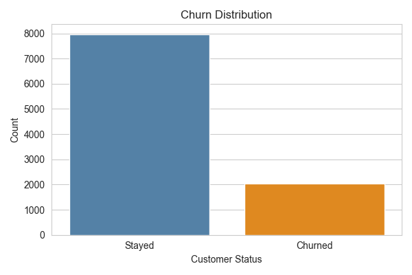
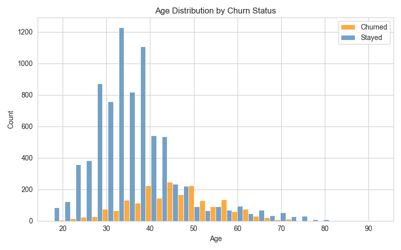
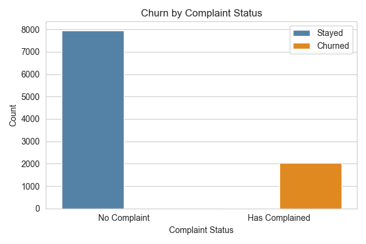
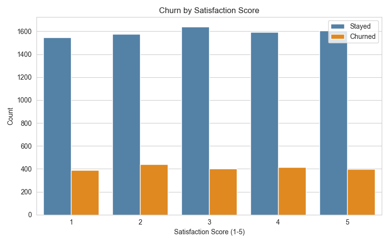
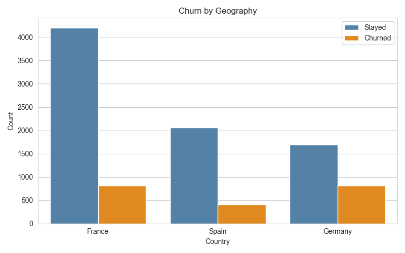
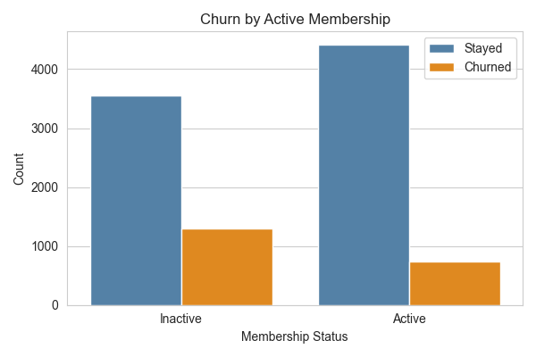
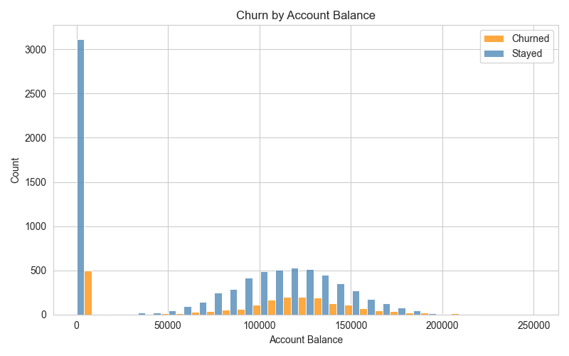
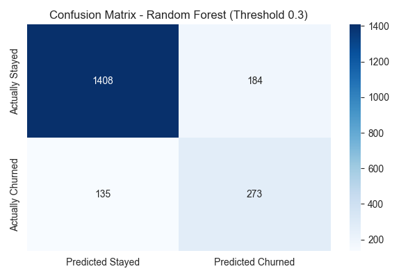
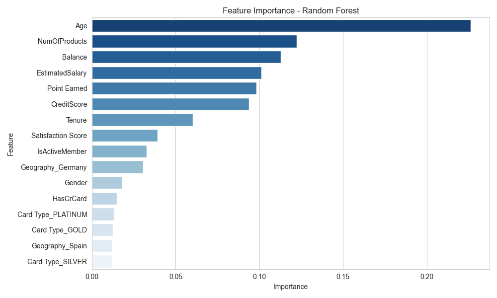

# Customer Churn Prediction

A machine learning project that predicts which bank customers are likely to churn, using exploratory data analysis, feature engineering, and classification models — with actionable business recommendations.

> *"Retaining an existing customer costs significantly less than acquiring a new one."*

---

## Project Overview

Customer churn is one of the most costly challenges in banking. This project builds a predictive model to identify at-risk customers before they leave, enabling the bank to intervene proactively rather than reactively.

Using a dataset of 10,000 bank customers, this project covers the full data science workflow:
- Exploratory Data Analysis (EDA)
- Data preprocessing and feature engineering
- Model building and comparison
- Business recommendations based on findings

---

## Dataset

- **Source:** [Bank Customer Churn Dataset — Kaggle](https://www.kaggle.com/datasets/radheshyamkollipara/bank-customer-churn)
- **Records:** 10,000 customers
- **Features:** 18 columns including credit score, age, balance, number of products, activity status, and complaint history
- **Target variable:** `Exited` — 1 = churned, 0 = stayed
- **Class distribution:** 79.6% stayed, 20.4% churned

---

## Project Structure

```
customer-churn-prediction/
│
├── churn_analysis.ipynb        # Main notebook: EDA, preprocessing, modelling, recommendations
├── Customer-Churn-Records.csv  # Dataset (not included in repo)
├── churn_distribution.png      # Churn distribution chart
├── churn_by_age.png            # Age distribution by churn status
├── churn_by_balance.png        # Balance distribution by churn status
├── churn_by_complaint.png      # Churn by complaint status
├── churn_by_satisfaction.png   # Churn by satisfaction score
├── churn_by_geography.png      # Churn by country
├── churn_by_products.png       # Churn by number of products
├── churn_by_active_member.png  # Churn by active membership status
├── confusion_matrix.png        # Confusion matrix for final model
├── feature_importance.png      # Feature importance chart
└── README.md                   
```

---

## Exploratory Data Analysis

### Churn Distribution


The dataset is imbalanced — 79.6% of customers stayed and 20.4% churned. This influenced model selection and evaluation metrics.

---

### Age Distribution by Churn Status


Customers aged 40–70 churn at disproportionately high rates relative to their population size, despite younger customers making up the larger volume of churners in absolute terms.

---

### Churn by Complaint Status


Complaint status is the single strongest indicator of churn — 99.8% of customers who complained subsequently churned. This feature was excluded from the model as it is a simultaneous indicator rather than a leading predictor (data leakage).

---

### Churn by Satisfaction Score


Surprisingly, satisfaction score showed no meaningful relationship with churn. Churn rates remained consistent across all satisfaction levels (1–5).

---

### Churn by Geography


Germany has a disproportionately high churn rate of approximately 32%, compared to roughly 16% in France and Spain — despite having a smaller customer base.

---

### Churn by Number of Products


Customers with 2 products are the most loyal. Those with 1 product represent the highest churn volume, while customers with 3–4 products show near-total churn rates.

---

### Churn by Active Membership


Inactive members churn at nearly double the rate of active members (28% vs 15%).

---

### Churn by Account Balance


Customers with mid-to-high balances (100,000–150,000) represent a significant churn risk. Zero-balance customers are predominantly retained.

---

## Preprocessing

- Dropped irrelevant columns: `RowNumber`, `CustomerId`, `Surname`
- Removed `Complain` to prevent data leakage
- Label encoded `Gender` (Male = 0, Female = 1)
- One hot encoded `Geography` and `Card Type`
- Converted boolean columns to integers
- Applied `StandardScaler` on training data only to prevent data leakage
- Train/test split: 80/20 with stratification to preserve class distribution

---

## Model Results

Three models were built and compared:

| Model | Accuracy | Precision (Churned) | Recall (Churned) | F1 (Churned) |
|---|---|---|---|---|
| Logistic Regression | 81.3% | 0.62 | 0.21 | 0.32 |
| Random Forest (threshold 0.5) | 86.8% | 0.82 | 0.46 | 0.58 |
| **Random Forest (threshold 0.3)** | **84.1%** | **0.60** | **0.67** | **0.63** |
| XGBoost | 82.8% | 0.57 | 0.64 | 0.60 |

**Final model: Random Forest with classification threshold of 0.3**

Lowering the threshold from 0.5 to 0.3 improved recall from 46% to 67% — the bank can now identify 2 out of 3 customers at risk of churning before they leave.

---

### Confusion Matrix


| | Predicted Stayed | Predicted Churned |
|---|---|---|
| **Actually Stayed** | 1,408 ✅ | 184 ⚠️ |
| **Actually Churned** | 135 ❌ | 273 ✅ |

- **273** churning customers correctly identified and flagged for retention
- **135** churning customers missed — most costly error
- **184** false alarms — unnecessary but low cost retention offers

---

### Feature Importance


| Feature | Importance |
|---|---|
| Age | 22.6% |
| Number of Products | 12.2% |
| Balance | 11.3% |
| Estimated Salary | 10.1% |
| Points Earned | 9.8% |
| Credit Score | 9.4% |

---

## Business Recommendations

### 1. Implement a Complaints Resolution Programme
Nearly every customer who raised a complaint subsequently churned. The bank should treat every complaint as a high-priority churn signal and implement a dedicated resolution team with a 24-hour response target.

*Expected impact: Addressing complaints early could retain a significant portion of the 20% of customers currently lost to churn.*

### 2. Launch Age-Targeted Retention Strategies
Customers aged 40–70 churn at disproportionately high rates despite typically holding more assets. The bank should introduce premium relationship banking for this segment — dedicated relationship managers, tailored financial planning services, and loyalty rewards.

*Expected impact: Retaining even 10% more of this segment would have an outsized impact on total deposits and revenue.*

### 3. Optimise Product Cross-Selling
Customers with 2 products are the most loyal. The bank should prioritise moving single-product customers to 2 products through targeted cross-selling. Customers with 3+ products should be reviewed — their near-total churn rate suggests product misalignment.

*Expected impact: Moving 1-product customers to 2 products shifts them into the lowest churn segment.*

### 4. Protect High-Value Balance Customers
Customers with balances between 100,000 and 150,000 represent a significant concentration of churn risk. The bank should introduce a high-value customer programme with enhanced benefits and personalised outreach.

*Expected impact: Reducing churn in this balance segment directly protects deposit levels and revenue.*

---

## Libraries Used

| Library | Purpose |
|---|---|
| pandas | Data manipulation and analysis |
| numpy | Numerical computing |
| matplotlib | Data visualization |
| seaborn | Statistical data visualization |
| scikit-learn | Machine learning models and preprocessing |
| xgboost | Gradient boosting model |
| jupyter | Interactive notebook environment |

---

## Author

**Noelle Mburu** — Data Scientist & Data Analyst
- [LinkedIn](https://www.linkedin.com/in/noelle-mburu)
- [GitHub](https://github.com/noelle-mburu)